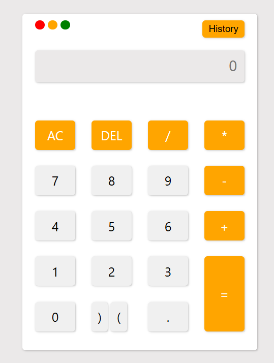

## SimpleMath Calculator

### Description
This is a simple web-based calculator built using HTML, CSS, and JavaScript. It supports basic arithmetic operations and includes a history feature to track previous calculations using `localStorage`.

### Edge Cases Handled
- Prevents multiple operators being entered consecutively.
- Alerts the user if `=` is pressed with an empty input.
- Handles invalid expressions using a `try-catch` block.
- Limits long decimal results to two decimal places for readability.
- History persists across page reloads using `localStorage`.

 

